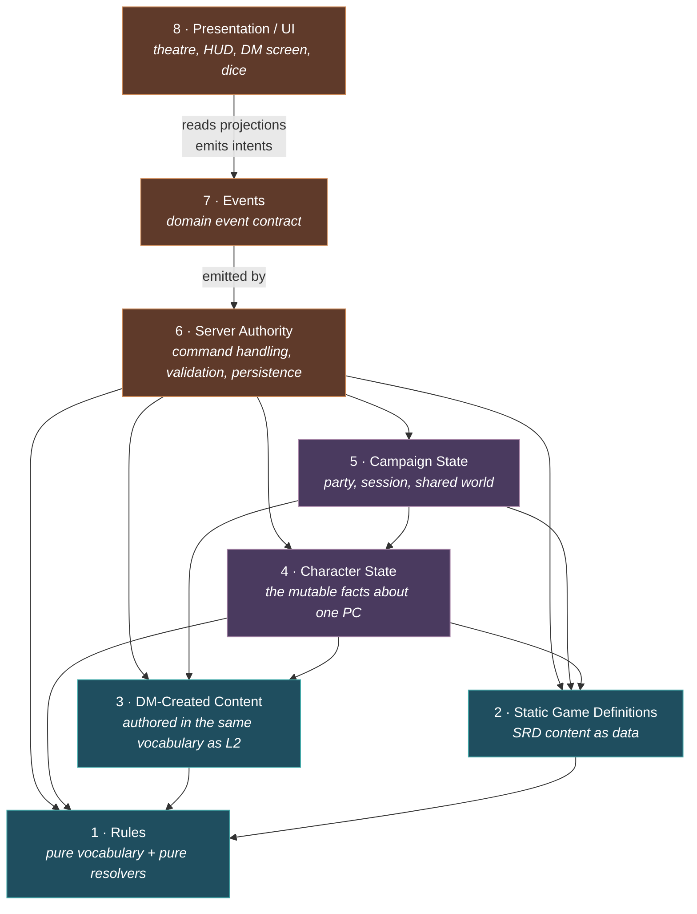
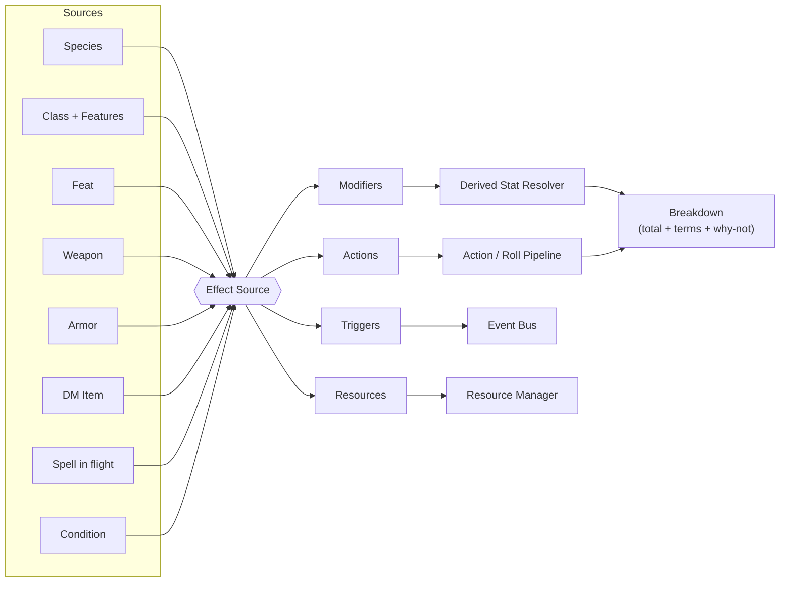
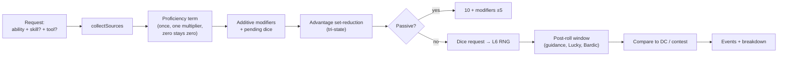
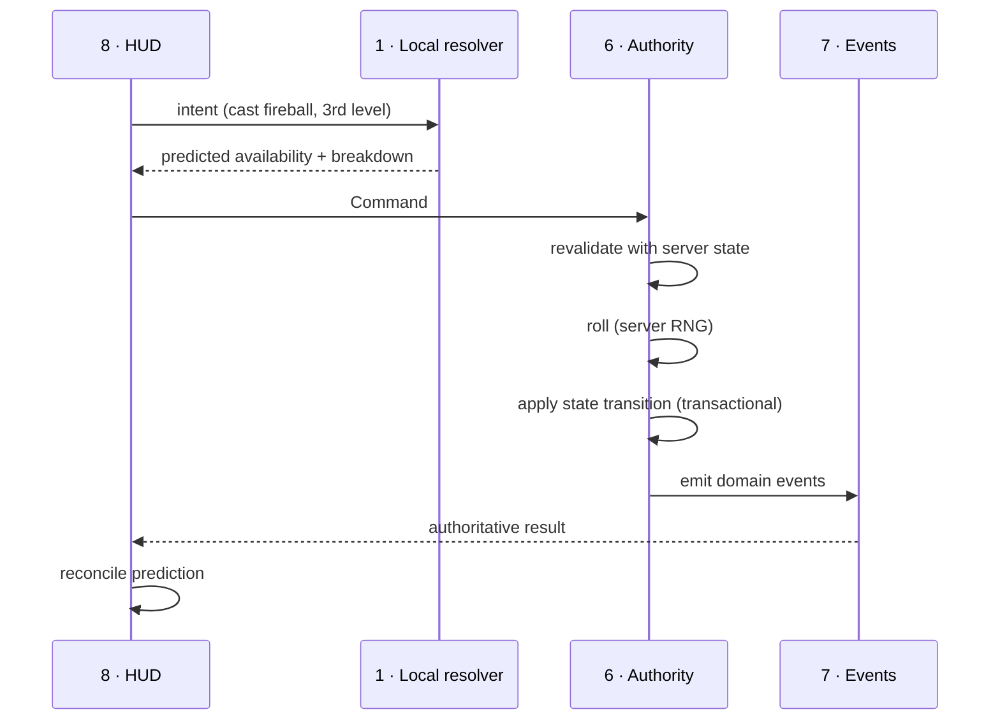
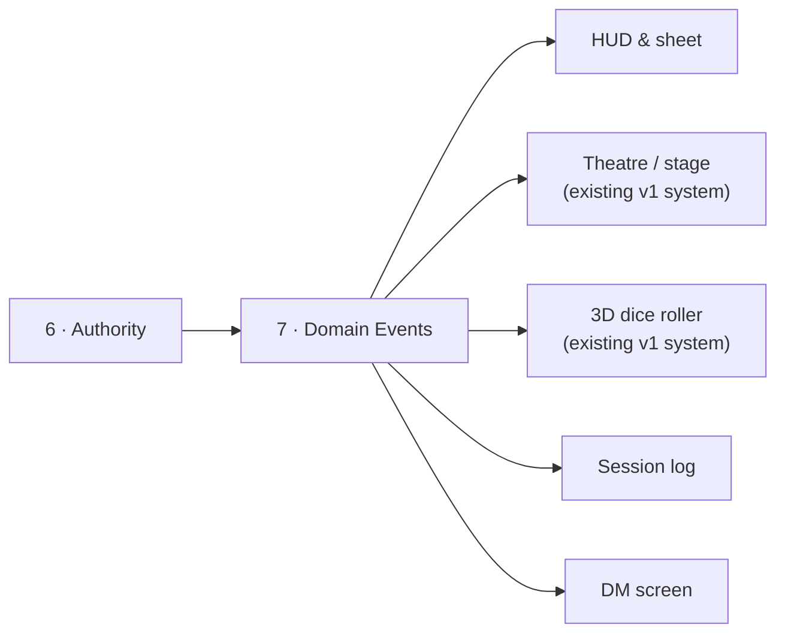

# Dungeon Theatre v2 — Rules & State Engine Architecture

**Status:** final architecture. Supersedes `rules-engine-architecture.md`, which
was written before the SRD read and is wrong in several places (see §14).
**Grounded in:** the complete sequential read of SRD 5.1, distilled in
`srd/91-effect-vocabulary.md`.
**Scope:** design only. No code, no schemas, no migrations, no datasets.

---

## 0. The product constraint that drives everything

This is not a rules tool with a theatre bolted on. It is a **theatrical
multiplayer experience** with rules underneath. Two consequences shape every
decision below:

**The HUD must be able to answer "why".** A Baldur's Gate 3 tooltip says
*"18 = 10 base + 4 Dex + 2 shield + 2 Shield of Faith"*. A Roll20 sheet says
*"18"*. The difference is not cosmetic — it is the entire reason a player can
act confidently from a compact HUD instead of opening a character sheet. This
means **the resolver's return value is a breakdown, not a number**, and that
constraint propagates all the way down. It is the single most load-bearing
decision in this document.

**The rules engine must feed drama, not just arithmetic.** If the engine emits
`damage: 7`, the theatrical layer has nothing to work with. If it emits
`CharacterBloodied`, `ConcentrationBroken`, `DeathSaveFailed(2 of 3)`,
`CriticalHit`, `LastSpellSlotSpent` — the stage can react. Event design is
therefore a first-class concern, not an afterthought (§8).

---

## 1. The eight layers

Dependencies point **downward only**. A layer may never import from a layer
above it. This is the property that makes the engine testable without a
database, a network, or a renderer.



| # | Layer | What lives here | What must never live here |
|---|---|---|---|
| 1 | **Rules** | The vocabulary types (Effect Source, Modifier, Action, Trigger, Resource, StatPath, RollRequest, RollResult) and the **pure resolvers** that combine them. Zero content. | Any specific spell, item, class or condition. Any I/O. |
| 2 | **Static Game Definitions** | SRD content expressed *in the L1 vocabulary*: species, classes, spells, weapons, armour, gear, feats, conditions. Immutable, versioned, shipped with the app. | Any per-character or per-campaign value. Any bespoke code. |
| 3 | **DM-Created Content** | Homebrew items, feats, features, conditions — **the same type as L2**, differing only in `provenance`. Scoped to a campaign. | A parallel item system. A code escape hatch. |
| 4 | **Character State** | Only what cannot be derived: identity, chosen build path, current HP, temp HP, spent resources, active effect instances, inventory contents and equipped slots, attunement, death save counters. | Any derived number (AC, max HP, spell save DC, skill modifiers). |
| 5 | **Campaign State** | Party membership, session, calendar/clock, shared inventory, pending trades, world flags, DM notes, scene and staging state. | Rules logic. Per-character derived values. |
| 6 | **Server Authority** | Command handlers. The **only** writer to L4/L5. Validation, RNG, transaction boundaries, conflict resolution. | Presentation concerns. Rules logic (it *calls* L1, it doesn't reimplement it). |
| 7 | **Events** | A stable, versioned, domain-shaped event contract. Append-only log plus realtime broadcast. | UI instructions ("shake the screen"). Raw state dumps. |
| 8 | **Presentation** | Theatre view, HUD, DM screen, dice renderer, sheet. Consumes projections and events; emits **intents**, never state writes. | Any authoritative computation. |

### Why DM content is layer 3 and not a special case

This is the architectural claim the brief demands, so it is worth stating
sharply:

> **`StaticDefinition` and `DMContent` are the same type.** A homebrew flaming
> sword and a SRD +1 longsword are the same shape, resolved by the same code
> path, differing only in a `provenance` field.

If a DM-authored item ever needs a capability that SRD content cannot express,
that is a bug in the vocabulary — the fix is to extend L1, which extends both at
once. There is no code path where DM content is interpreted differently, and no
scripting hook where a DM writes calculation logic. The SRD's own homebrew
guidance supports this: traps, poisons and diseases are all authored from the
same `trigger → save/attack → damage/condition → recurrence → end` shape
(`srd/09-dm-content.md` §"What this section proves about DM authoring").

---

## 2. The one unifying abstraction: the Effect Source

Everything that can change a character is an **Effect Source**. Species,
classes, class features, feats, weapons, armour, other equipment, spells in
flight, conditions, diseases, poisons, environmental effects and DM-authored
items are all instances of this one type.

```
EffectSource
├── identity      id, name, provenance (srd | dm | system), contentVersion
├── kind          species | class | feature | feat | item | spell | condition | environment
├── activation    when this source is live (see §2.1)
├── modifiers[]   passive changes to derived stats and rolls
├── actions[]     things the player can choose to do
├── triggers[]    reactive effects bound to events
├── resources[]   pools this source owns (uses, charges, slots)
└── narrative     text the engine cannot model, surfaced as-is (§13)
```



### 2.1 Activation — the part that is easy to get wrong

A source is not simply "on". Activation is itself derived, and re-evaluated
whenever its inputs change:

| Gate | Evidence from the SRD |
|---|---|
| **Possessed** | in inventory |
| **Equipped** | in a body slot; **paired items need both halves**; horseshoes need all four |
| **Attuned** | 3 slots; ends if prerequisites lapse, if >100 ft away for 24 h, on death, or if another creature attunes |
| **Prerequisite met** | *"If you ever lose a feat's prerequisite, you can't use that feat until you regain it"* — feats, `belt of giant strength` + `gauntlets of ogre power` for *hammer of thunderbolts*, alignment for *robe of the archmagi*, race for *dwarven thrower* |
| **Level reached** | Tiefling *Infernal Legacy* unlocks at 1/3/5; class features by level |
| **Toggled by the player** | *cloak of elvenkind*'s hood, *flame tongue*'s flame, Rage, *sun blade*'s blade |
| **Suppressed** | *antimagic field* suspends a source while **its duration keeps running** |

**Consequence:** activation is a *predicate over character state*, which means
the derived-stat graph has **feedback edges** — an effect that lowers Strength
can deactivate a feat that grants other effects. The resolver must handle this
(§4.3).

### 2.2 Modifier — passive change

```
Modifier
├── target     StatPath (a derived stat) | RollScope (a class of future rolls)
├── operation  base | add | set | min | max | multiply | suppress | replace
├── value      constant | dice expression | formula over character state
├── condition  optional predicate (situational, tag-scoped, target-scoped)
└── tags       for suppression, dedup, and breakdown display
```

Each operation has its **own combination rule**, derived from the read. This is
the correction the old draft most needed:

| Operation | Combination | Evidence |
|---|---|---|
| `base` | **Highest wins** | Six competing AC providers: armour, Barbarian and Monk Unarmoured Defense, Draconic Resilience, *mage armor*, *robe of the archmagi* |
| `add` | **Sums** | ability modifiers, `+1` items |
| `set` | **Last wins**, each gated "no effect if already higher" | *amulet of health*, *belt of giant strength* |
| `min` | Floor, applied last | *barkskin* |
| `max` | Cap — **and the cap is itself derived** | 20 → 24 (Star card) → 30 (*hammer of thunderbolts*); manuals raise it permanently |
| `multiply` | **Once only, and zero stays zero** | Expertise; Artificer's Lore doubles nothing if you lack History |
| `suppress` | Removes a tagged modifier or requirement | Dwarf ignores heavy-armour speed loss; *mithral armor* deletes the Stealth penalty; *elven chain* waives its own proficiency requirement |
| `replace` | Overrides a computed value | *shillelagh* (ability + damage die), *sun blade* (damage type), *glibness* (substitutes 15 for a d20) |

**Cover, the proficiency multiplier and same-spell stacking are max-wins slots,
not sums.** *"If a target is behind multiple sources of cover, only the most
protective degree applies."* *"The effects of the same spell cast multiple times
don't combine — the most potent effect applies."*

### 2.3 RollScope — why modifiers can't only target stat paths

Several modifiers target *a class of future rolls*, not a stat:

- *"advantage on saving throws **against poison**"* (Dwarven Resilience)
- *"advantage on INT, WIS and CHA saves **against magic**"* (Gnome Cunning)
- *"advantage on WIS (Perception) checks **that rely on sight**"*
- *"disadvantage on attack rolls **against demons**"* (Demon Armor)
- *"advantage on STR (Athletics) checks **to climb or swim**"*

"Against poison" is a predicate over the **incoming effect's tags**, not a stat
path. So:

> **Every roll request carries semantic tags describing its source and target**
> — damage types, conditions inflicted, magical/nonmagical, creature types,
> activity tags — and RollScope predicates filter on them.

### 2.4 Action — active use

```
Action
├── cost          action | bonus action | reaction | free | movement | time (minutes/hours/days)
├── requirements  resources, components, hands free, body state, positioning, proficiency
├── parameters    targets, slot level, metamagic, mode selection, charge count
├── effects[]     rolls to request, state changes to apply, events to emit
└── availability  a derived predicate → "why is this greyed out?"
```

`availability` deserves emphasis. *"Grey out the spell and say why"* is one of
the highest-value HUD wins available, and it falls out of component checking:
gagged (no verbal), no free hand (no somatic), missing a costed component,
already concentrating, no slot of sufficient level, not proficient with the
armour you are wearing.

### 2.5 Trigger — reactive

```
Trigger
├── event      a predicate over the domain event stream
├── window     immediate | reaction | player-decision-window | scheduled
├── authored?  true for player-written conditions (§7)
└── effects[]
```

### 2.6 Resource — pools with refresh rules

```
Resource
├── id, owner (source or character)
├── max        formula over character state (level, ability modifier, PB)
├── current
└── refresh    RefreshRule
```

Ten distinct refresh triggers appear in the SRD (`srd/91-effect-vocabulary.md`
§7): short rest, long rest, **half-on-long-rest** (Hit Dice), **dawn**
(dominant for items, usually `1dN expended charges`), **dusk**, fixed multi-day
cooldowns, **cumulative-duration stopwatches** (*boots of speed*: 10 minutes of
use total), **finite lifetimes ending in destruction**, campaign-calendar
events, and the **burnout roll** (a d20 on spending a wand's last charge; a 1
destroys it, and two staffs regain charges on a 20).

`RefreshRule` must therefore be a small tagged union, not an enum of two rest
types.

---

## 3. Layer 2/3 content taxonomy for v1

Aligned to your priority list. Everything here is data authored in the L1
vocabulary; **none of it is code**.

| Content type | v1 scope | Notes |
|---|---|---|
| **Species** | All 9, with their 4 subraces | Species is a detachable effect bundle — *reincarnate* swaps it wholesale, and so does a respec |
| **Classes** | All 12, levels 1–20, base class only | Subclass is a **slot on the class** that is present but holds a menu of one |
| **Subclasses** | Data present, no UI emphasis | Deliberately not a priority, but the slot must exist or retrofitting is painful |
| **Backgrounds** | Acolyte only + a custom builder | SRD has exactly one |
| **Feats** | **System yes, catalogue no** — Grappler only | Per your instruction. The system is small and it exercises the prerequisite predicate language |
| **Spells** | All ~320, full statblock + effects | Highest-volume dataset |
| **Equipment** | All weapons, armour, gear, tools | Extremely important per your brief |
| **Magic items** | Ship the mechanically-simple majority; explicitly out-of-scope the machine items (§13) | The +N families, resistances, ability setters, charge-based casters |
| **Conditions** | **BLOCKED** — the appendix is missing from the PDF | See §15 |
| **Monsters** | None | Not MVP |
| **Traps / poisons / diseases** | Authoring shape only, no catalogue | They validate the DM-content vocabulary |

### Content identity and versioning

Every definition carries `{ id, contentVersion, provenance }`. Character state
references content **by id, never by embedding**. When a DM edits a homebrew
sword, every character holding it changes — which is what a DM expects, but it
means:

> **Content edits must be versioned and character state must record which
> version it was built against**, or a mid-campaign edit silently invalidates
> saved characters. This is the cheapest thing to get right now and one of the
> most expensive to retrofit.

---

## 4. Layer 1: the resolvers

Three pure functions. Everything else is orchestration.

### 4.1 `collectSources(character, campaign) → EffectSource[]`

Walks species, class levels, feats, equipped and attuned items, active effect
instances, and campaign-level environmental sources. Evaluates each source's
`activation` predicate. Returns the live set **plus the inactive set with
reasons**, because the HUD needs to say *"Grappler is inactive: Strength 12 < 13"*.

### 4.2 `resolveStat(statPath, sources, character) → StatValue`

```
StatValue {
  total: number
  terms: [{ sourceId, sourceName, operation, value, applied: bool, reason? }]
}
```

**The `applied: false` terms are not optional.** An advantage that cancelled, a
proficiency multiplier that hit zero, a bonus suppressed by a stronger `base` —
discarding these is exactly what makes rules engines feel opaque, and it is the
difference between the experience you want and the one you don't.

Resolution order: `base` (max-wins) → `add` (sum) → `multiply` (single) →
`set` (override) → `min`/`max` (clamp) → `replace`.

### 4.3 Handling the dependency cycle

Activation predicates can read derived stats, and derived stats depend on
activation. The SRD makes this concrete: a curse lowers Strength below 13,
Grappler switches off, and Grappler's own grants disappear.

**Approach:** resolve to a fixed point over a bounded number of passes
(3 is empirically sufficient), with a cycle detector that fails loudly in
development and falls back to last-stable in production. Do **not** pretend the
graph is acyclic — it isn't, and discovering that later is expensive.

### 4.4 `resolveRoll(request, sources, character) → RollResolution`

Produces everything needed *before* dice are thrown:

```
RollResolution {
  dice:        { count, sides, keep: 'highest'|'lowest'|'all' }
  modifiers:   StatValue-style breakdown, including pending dice (bless's 1d4)
  advantage:   'advantage' | 'disadvantage' | 'normal'
  advSources:  [...], disSources: [...]     // kept even when they cancel
  target:      { kind: 'dc'|'ac'|'contest', value?, opponent? }
  hooks:       interception points open on this roll
}
```

Note this function **does not roll**. Randomness lives in L6 only (§6).

---

## 5. The check, attack, cast and damage pipelines

### 5.1 Ability check



**Ability, skill and tool are three independent inputs.** The SRD explicitly
sanctions Constitution (Athletics) and Strength (Intimidation), and tool
proficiency is bound to no ability at all. A `Skill` enum that implies an
ability is wrong and will have to be torn out.

### 5.2 Attack

Same spine, plus: weapon property resolution (finesse chooses the *same*
ability for attack and damage; thrown inherits the melee ability), range band
→ disadvantage, cover → max-wins AC/DEX-save bonus, natural 20 auto-hit and
natural 1 auto-miss (**attack rolls only** — the SRD does not extend this to
checks or saves), and crit-range as a derived stat (19–20, 18–20).

### 5.3 Damage

```
typed components[]  →  crit rule (dice only, incl. feature dice; Savage Attacks
                       adds one more)
                    →  flat modifiers
                    →  flat reductions
                    →  resistance / vulnerability  (AFTER everything; dedup by
                       type; at most one halving and one doubling)
                    →  damage threshold (objects)
                    →  temporary HP
                    →  HP
```

Damage is **a list of typed components**, never a scalar — *flame strike* deals
4d6 fire *and* 4d6 radiant, resisted independently.

### 5.4 Casting

```
CastRecord {
  spellId, slotLevel, effectiveSpellLevel,   // separately meaningful
  statisticsSource,                           // caster | item | originalCaster
  metamagic[], componentsSatisfied, concentration
}
```

- **Slot level ≠ spell level.** *Globe of invulnerability* compares against the
  spell's own level; *counterspell* and *dispel magic* compare against the slot.
  Both must be recorded.
- **Upcasting is a lookup table, not a formula** — linear, per-two-levels,
  tiered, slot-tier-specific, duration-tiered, and sometimes *removing the
  concentration requirement*.
- **Concentration is a singleton slot** with an automatic CON save at
  `max(10, damage/2)`, **once per damage source**.

---

## 6. Layer 6: server authority

**Recommendation: authoritative server for state mutation, optimistic local
prediction for feel.** This is the answer to your earlier "whatever works best".

The reason it works here specifically: **L1 is pure and portable**, so the exact
same resolver runs on the client for prediction and on the server for truth.
There is one implementation, not two — which is the usual reason
client-prediction architectures rot.



**Rules the authority enforces:**

1. **All randomness is server-side.** The 3D dice roller must *animate a result
   the server produced*, not produce one. v1 already proved the technique: the
   physics is never steered, the die is relabelled so the settled face carries
   the rolled value. That property is what makes server-authoritative dice
   possible without the roll feeling fake — keep it.
2. **Commands are intents, not state writes.** `CastSpell`, `EquipItem`,
   `ProposeTrade`, `SpendHitDie` — never `SetHP`.
3. **The DM has an explicit override command at every resolution point.** The
   SRD demands this (*"you shouldn't allow die rolling to override clever
   play"*), and it is the pressure valve that stops the engine feeling
   tyrannical. `DMOverride` must be a first-class, logged command — not a hack.
4. **Two-party operations are transactional.** Trades commit atomically or not
   at all; contests resolve both rolls in one transaction.
5. **Hot path is broadcast, cold path is persisted.** v1 already learned this:
   presentation-rate updates go over realtime broadcast and never touch
   Postgres; durable state changes are transactional writes. Keep the split.

**Redaction is an authority concern, not a UI one.** DM-only rolls, hidden
Stealth totals, unidentified item true-identities: the server must project
different views per recipient. v1's `security_invoker` view approach for
column-level redaction is the right pattern to carry forward.

---

## 7. The trigger/condition language

The SRD forces this — it is not gold-plating. Seven spells and every trap take a
**player-authored condition**, and the SRD even constrains the predicate
language itself:

| Spell | Constraint the SRD places on the predicate |
|---|---|
| *magic mouth*, *programmed illusion* | "based on visual or audible conditions within 30 feet" |
| *glyph of warding*, *symbol* | refinable by physical characteristics, creature kind, or alignment; password exemptions |
| *imprisonment* | "based on observable actions or qualities and **not on intangibles such as level, class, or hit points**" |
| *sequester* | "must occur or be visible within 1 mile of the target" |

So: a **small, bounded predicate DSL** over the domain event stream, with a
declared scope, an optional cooldown (*programmed illusion*: 10 minutes) and a
one-shot/repeating flag. Bounded is the operative word — it is a filter
language, not a scripting language. If a DM needs something it cannot express,
the answer is narrative text plus a DM trigger button (§13), **not** an
`eval()`.

The same machinery serves system triggers: entering an area for the first time
on a turn, being hit by a melee attack (*fire shield*), taking damage while
concentrating, dropping to 0 HP, "the next time you hit" riders, and scripted
per-round timelines (*storm of vengeance*).

---

## 8. Layer 7: the event contract

Two consumers, one contract:



**Design rule: events are semantic, never presentational.** `ScreenShake` is
wrong. `CriticalHit` is right — the theatrical layer decides that a critical
means a screen shake, and can change its mind without touching the rules engine.

Event families:

| Family | Examples | Consumed by |
|---|---|---|
| **Roll lifecycle** | `RollRequested`, `RollAwaitingModification`, `RollResolved` | dice, HUD, log |
| **Resource** | `SlotSpent`, `LastSlotSpent`, `ChargesRestored`, `ItemDestroyed` | HUD, theatre |
| **Vitality** | `DamageTaken`, `Bloodied`, `DroppedToZero`, `DeathSaveSucceeded(n/3)`, `DeathSaveFailed(n/3)`, `Stabilized`, `Died` | theatre (strongly), HUD |
| **Effects** | `ConditionApplied`, `ConditionEnded`, `ConcentrationBroken`, `AttunementLost` | HUD, theatre |
| **Character** | `LeveledUp`, `FeatGained`, `AbilityScoreChanged` | HUD, theatre |
| **Inventory** | `ItemEquipped`, `TradeProposed`, `TradeCompleted`, `ItemIdentified` | HUD, all party members |
| **Interaction** | `InteractionOpened`, `InteractionResolved`, `InteractionExpired` | HUD (§9) |
| **DM** | `DMOverrideApplied`, `SceneChanged`, `NPCStaged` | everything |

`Bloodied`, `LastSlotSpent` and `DeathSaveFailed` are not SRD concepts — they
are **derived dramatic beats**. Emitting them is how the rules engine earns its
place in a theatrical product.

---

## 9. Pending interactions — one primitive, not five

The read found five interaction shapes that all need a networked pause. Building
five bespoke flows would be a mistake; they are one primitive:

```
PendingInteraction {
  kind:        post-roll-window | contest | group-check | help | sequential-choice
  participants[]
  prompt
  options[]
  deadline     // timer | explicit resolve | DM advance
  onResolve
  onTimeout
}
```

| Shape | Instances |
|---|---|
| **Post-roll window** | *guidance*, *resistance* (both **cantrips** — this is unavoidable), Bardic Inspiration, Cutting Words, Foe Slayer, *shield*, Halfling Lucky, *wish* |
| **Contest** | grapple, shove, hide vs. search, *telekinesis*; **the defender often chooses which ability to use** |
| **Group check** | everyone rolls, half must succeed |
| **Help** | one player grants another advantage, with an eligibility check |
| **Sequential choice** | spending Hit Dice on a short rest — roll, see result, decide again |

**Recommendation on the timing question you asked earlier:** default to
**explicit resolve by the roller, with a visible countdown that auto-resolves**.
Pure timers punish slow players and break immersion; pure manual resolution
stalls on an AFK player. A countdown with a "resolve now" button, plus a DM
"advance" override, handles both. This is a UX decision you can change later
*provided* it lives in one primitive rather than five.

---

## 10. Inventory as multiplayer state

Your brief calls equipment "extremely important", and inventory is the one
subsystem that is inherently shared:

- **Containers have capacity** (weight, volume, and "strapped to the outside").
- **Body slots have occupancy rules** — one cloak, one headwear, **paired boots
  and gloves need both halves**, horseshoes need all four.
- **Attunement is a three-slot resource** with live prerequisites that can
  reference *other attuned items* (*hammer of thunderbolts*).
- **Identification is not authoritative.** *Potion of poison* and *dust of
  sneezing and choking* defeat *identify*; *armor of vulnerability* hides its
  curse until attunement. Items need a **true identity and an apparent
  identity**, and the server must project the apparent one to players.
- **Trades are explicit and two-party**, committed transactionally.
- **Items are damageable entities** with AC and HP.
- **Equipping changes derived stats**, so the inventory UI must show the
  before/after breakdown — a natural fit for the HUD.

---

## 11. Integration with the existing v1 systems

Nothing in v1 is rewritten. The rules engine attaches through events and
projections only.

| Existing system | Integration | Direction |
|---|---|---|
| **Discord voice + speaker detection** | Unchanged. Speaking state stays a presentation concern; the rules engine neither reads nor writes it. | — |
| **Stage / theatre view** | Subscribes to domain events; maps them to portraits, effects, camera. No rules knowledge. | events → theatre |
| **3D dice roller** | Receives a **structured dice request that already contains the result**; animates to it via the existing relabel-not-steer technique. | authority → dice |
| **Scene effects** (fog/rain/lightning/wind/sun/gloom) | Can now be driven by rules events *and* by the SRD's own weather ladders (*control weather* has exactly three ladders that map onto the existing effects). | events → theatre |
| **Supabase realtime** | Hot path stays broadcast-only. Rules state changes are transactional writes plus an event broadcast. | — |
| **Player web app** | Gains the HUD; the theatre view is unchanged and stays host-agnostic. | — |
| **RLS model** | Extends to the new tables using the existing `security definer` helper and `security_invoker` view patterns. | — |

---

## 12. Build order

Each step is independently demonstrable. No step requires the next one to exist.

| Phase | Deliverable | Proves |
|---|---|---|
| **0** | Resolve the conditions blocker (§15) | Unblocks everything downstream |
| **1** | L1 vocabulary + resolvers, no content | The eight operations and their combination rules, tested against SRD worked examples |
| **2** | Species + classes 1–20 as L2 data | That progression is data, not code |
| **3** | Ability scores, skills, saves, proficiency, HUD breakdowns | **The "why" tooltip.** The riskiest UX bet, validated early |
| **4** | Equipment, inventory, body slots, attunement | Your "extremely important" item |
| **5** | Actions, rolls, damage, dice integration | Closes the loop with the existing 3D dice |
| **6** | Conditions + resources + rest | The state model under load |
| **7** | Spells and spellcasting | Highest volume; depends on everything above |
| **8** | Feat system (Grappler only) + DM content authoring | Proves L2 ≡ L3 |
| **9** | Trades, pending interactions, multiplayer polish | The shared-state layer |

**Phase 3 before phase 7 is deliberate.** If the HUD breakdown doesn't feel
right with something as simple as a skill check, adding 320 spells will not fix
it — and by then it will be far more expensive to change.

---

## 13. What is deliberately not modelled

Being explicit is better than half-modelling. Each of these is **descriptive
text plus a DM helper**, and is *labelled as such in the UI* rather than
silently dropped.

| Category | Handling |
|---|---|
| **Narratively-scoped bonuses** (Stonecunning, Artificer's Lore, Natural Explorer, Favored Enemy, crowbar leverage) | A player-facing toggle on the roll, defaulting to off, with the rule text shown |
| **Anything needing a statblock** (Wild Shape, all *conjure* spells, *polymorph*, familiars, steeds, figurines) | Deferred; a `StatblockRef` placeholder that a DM fills in later |
| **Stateful machine items** (*apparatus of the crab*, *deck of many things*, *wand of wonder*, *rod of lordly might*) | Out of scope; text plus a DM roll helper |
| **Sentient items** | DM narration plus a contested-check helper |
| **Negotiation** (*planar ally*) | Text only |
| **Open-ended *wish*** | Text plus DM adjudication |
| **Lifestyle, trade goods, services** | Reference data for a shop UI; no rules |
| **Survival and downtime clocks** | Not MVP, per your instruction; the campaign calendar exists so they can be added without restructuring |

---

## 14. Technical debt risks — what would hurt later

This is the section you asked for explicitly. Ordered by how expensive each is
to fix after the fact.

### Severe — would require a rewrite

**14.1 Storing derived values instead of computing them.**
The SRD makes this unrecoverable, not merely untidy: *"When your Constitution
modifier increases by 1, your hit point maximum increases by 1 **for each level
you have attained**."* An *amulet of health* setting CON to 19 retroactively
changes max HP at every past level. If max HP is a stored accumulator, every
such interaction is a bug, and each one gets patched individually until the
system is unmaintainable. **Derived stats are computed, never stored.** The only
stored numbers are current HP, temp HP, spent resources and choices made.

**14.2 The UI recomputing rules.**
Two implementations of the same rule diverge — always, and usually silently. The
fix is structural: **L1 is a pure, portable module the client imports for
prediction and the server imports for truth.** One implementation, two call
sites.

**14.3 Bespoke per-item logic.**
The thing your brief explicitly prohibits. The failure mode is gradual: one
item needs something the vocabulary can't express, so it gets a special case;
six months later there are forty special cases and DM content can't reach any of
them. **Guardrail: if SRD content needs a capability, extend L1 — never add a
branch.** Enforce it with a test that resolves a representative SRD item of each
category through the generic path only.

**14.4 A rules layer that depends on the database.**
Putting resolution in Postgres functions or coupling it to RLS makes the engine
untestable in isolation, unusable for client prediction, and impossible to
version. **L1 has zero I/O.**

**14.5 Baking species/class into the character at creation.**
*Reincarnate* rewrites a character's species and racial traits wholesale, and
respec/level-up need the same capability. If traits are merged into a character
record at creation there is no way back. **Build path is a list of choices;
traits are always derived from it.**

### Serious — expensive but survivable

**14.6 Treating advantage as a number, or as a counter.**
It is a tri-state reduced from two boolean sets: they never stack, any
advantage plus any disadvantage yields *neither*, and in passive form the same
state becomes ±5. Modelling it as `+/-` produces wrong results immediately and
wrong *explanations* forever.

**14.7 A `Skill` enum that implies an ability.**
Constitution (Athletics) and Strength (Intimidation) are explicit SRD rules, and
tool proficiency has no ability at all. This looks like a harmless simplification
and threads through every check call site.

**14.8 Conditions as booleans on the character.**
A condition is an *instance*: source, duration, save-to-end (which ability, what
DC, when), suppression state, and stacking rules. *Contagion*, *flesh to stone*
and *prismatic wall* all use a three-strikes counter; *antimagic field*
suppresses effects **while their duration keeps running**. Booleans model none
of this.

**14.9 Discarding the breakdown.**
If the resolver returns a number, the HUD can never explain itself, and the
product degrades into the spreadsheet you don't want. Retrofitting a breakdown
means touching every resolver and every call site.

**14.10 Presentational events.**
If the rules engine emits `ScreenShake`, the theatrical layer's vocabulary is
frozen into the rules layer and every visual change becomes a rules change.

**14.11 Unversioned content.**
A DM edits a homebrew item mid-campaign and silently invalidates saved
characters. Cheap now, painful later.

**14.12 Assuming one roller per roll.**
Contests, group checks, Help and post-roll windows are all multi-participant.
A single-player roll type forces four bespoke retrofits.

**14.13 Conflating spell level and slot level.**
*Globe of invulnerability* compares one; *counterspell* compares the other.
Storing a single number makes one of them permanently wrong.

### Moderate — worth a design note now

**14.14 Deferring subclass and multiclass so hard they become impossible.**
You've deprioritised both, correctly. But **the shape must exist**: a subclass
is a slot on a class, and multiclassing means class levels are a *list*, not a
scalar. Model `classLevels: [{classId, level, subclassId?}]` from day one even
though v1 only ever puts one entry in it. That costs nothing now; the
alternative is a schema migration plus a rewrite of every level-dependent
formula.

**14.15 No DM override path.**
The SRD repeatedly instructs the GM to overrule the dice. An engine that can't
be overridden will be fought by its users, and the workaround will be worse than
the feature.

**14.16 Round-tripping every interaction to the server.**
Without local prediction, a compact action HUD feels sluggish and the theatrical
illusion breaks. Mitigated by 14.2's portable resolver.

**14.17 Fixed-point resolution treated as acyclic.**
The activation ↔ derived-stat cycle is real. Assuming a DAG works until the
first curse-lowers-Strength-deactivates-feat case, which then presents as an
inexplicable ordering bug.

---

## 15. The one open blocker

**The conditions appendix is not in the SRD PDF you supplied.** "Appendix PH-A"
is referenced by name on ten pages and its conditions are invoked by nearly
every class, spell, trap, poison and magic item, but the document ends at p253
with the *Orb of Dragonkind*. Verified by full-text search across all 253 pages.

Undefined but required: blinded, charmed, deafened, **exhaustion (all six
levels)**, frightened, grappled, incapacitated, invisible, paralyzed, petrified,
poisoned, prone, restrained, stunned, unconscious.

You listed conditions as important for v1, so this is phase 0. Send me the
missing appendix — it is two pages, present in the full SRD 5.1 release and in
the CC-BY SRD 5.2 document. Reconstructing it from usage elsewhere would be
partly guesswork and would bake errors into the layer everything else touches.

---

## 16. Summary of the corrections to the earlier proposal

| Earlier draft said | The read established |
|---|---|
| One modifier combination rule (additive) | **Eight operations, each with its own combination rule**; `suppress` and `replace` were missing entirely |
| Advantage is a modifier | A **tri-state set-reduction**, becoming ±5 passively |
| Modifiers target stat paths | Many target **tagged classes of future rolls** |
| A check is `{ability, skill}` | **Three independent inputs**, plus GM fiat |
| A roll is atomic and single-player | **Five multi-participant interaction shapes**, one primitive |
| Resources refresh on short or long rest | **Ten distinct refresh triggers** |
| Effects are declarative data | Plus a **bounded, SRD-constrained trigger predicate language** |
| Four layers | **Eight**, with DM content proven to be the same type as SRD content |
