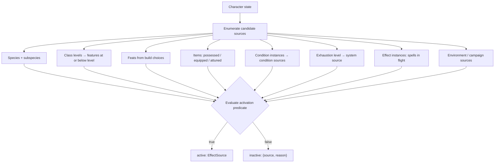
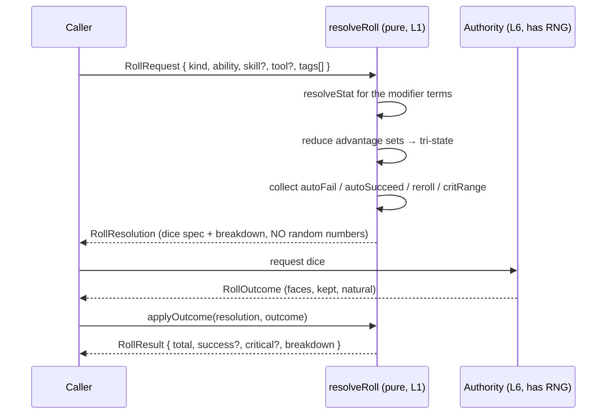
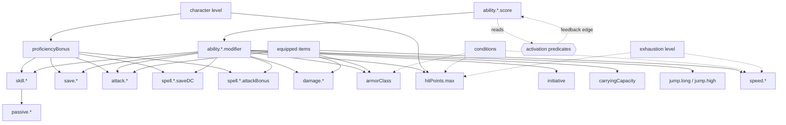

# Foundation Design — canonical vocabulary and deterministic resolution

**Phase:** the mathematical/state foundation. No content dataset, no UI, no
Discord/theatre integration.
**Implements:** `architecture.md` layers 1–4 (Rules, Static Definitions, DM
Content, Character State), specifically §2 (Effect Source), §4 (resolvers) and
the operation table in §2.2.
**Authoritative sources:** `srd/91-effect-vocabulary.md` (distilled from the
full SRD 5.1 read) and `srd/11-conditions.md`.

This document is the specification the code implements. It is deliberately
written before the code, and the code is written to it.

---

## 1. Canonical schema definitions

### 1.0 The three channels

An effect can change a character in exactly three ways. Keeping these separate
is what prevents the vocabulary from collapsing into a soup of special cases.

| Channel | Targets | Operations | Question it answers |
|---|---|---|---|
| **Value** | `StatPath` | the **eight** ops (§2) | *What is this number?* |
| **Roll state** | `RollScope` | advantage, disadvantage, autoFail, autoSucceed, reroll, replaceRoll, critRange | *How do the dice behave?* |
| **Capability** | `CapabilityKey` | grant, revoke | *Can I do this at all?* |

The user's item 10 ("grant or remove capabilities") is the capability channel;
items 1–9 are the value and roll-state channels.

### 1.1 Identity and provenance

Every definition carries the same identity block. This is what makes DM content
and SRD content the same type.

```
Identity {
  id: string                  // stable, namespaced: "srd:spell.fireball"
  name: string
  provenance: 'srd' | 'dm' | 'system'
  contentVersion: number      // bumped on any authored edit
  campaignId?: string         // set for provenance 'dm'
  sourceRef?: string          // "SRD 5.1 p143" or a DM note
}
```

`system` provenance is for engine-generated sources (e.g. the exhaustion effect
bundle assembled from a character's exhaustion level).

### 1.2 The 30 canonical concepts

Grouped by which architecture layer they belong to.

#### Layer 1 — Rules vocabulary (pure, content-free)

| Concept | Shape | Notes |
|---|---|---|
| **Ability** | `'str'\|'dex'\|'con'\|'int'\|'wis'\|'cha'` | Six, closed. |
| **AbilityScore** | derived `StatPath` `ability.<a>.score` | **Never stored.** Base 10 unless a build choice sets it. |
| **AbilityModifier** | derived `ability.<a>.modifier` | `floor((score − 10) / 2)`. Declared as a **computed stat**, not a modifier. |
| **Skill** | `{ id, defaultAbility }` | **`defaultAbility` is a default, not a constraint** — a check names its own ability. |
| **Proficiency** | `ProficiencyGrant { scope, level, roundingMode, source }` | `level: 'half'\|'proficient'\|'expertise'`. |
| **Expertise** | not a separate concept — `level: 'expertise'` (multiplier 2). | Prevents a parallel code path. |
| **SavingThrow** | a `RollRequest` with `kind: 'save'` and an `ability`. | Same pipeline as checks. |
| **Roll** | `RollRequest` → `RollResolution` → `RollOutcome` | Three distinct stages (§3.4). |
| **Check** | `RollRequest { kind: 'check', ability, skill?, tool? }` | Three independent inputs. |
| **Attack** | `RollRequest { kind: 'attack', ability, weaponRef?, spellRef? }` | Carries `critRange`, natural-20/1 rules. |
| **Damage** | `DamagePacket { components: DamageComponent[] }` | A **list of typed components**, never a scalar. |
| **Modifier** | see §1.3 | The atom of the value/roll/capability channels. |
| **Requirement** | a `Predicate` | Used by activation, actions and attunement alike. |
| **Trigger** | `{ event: EventPredicate, window, effects }` | §1.6. |
| **Target** | `TargetSpec` | Who/what an action or effect applies to. |
| **EffectSource** | see §1.4 | The single unifying abstraction. |
| **GameEvent** | see §1.7 | Domain-shaped, never presentational. |

#### Layer 2/3 — Content definitions (data authored in the L1 vocabulary)

| Concept | Shape |
|---|---|
| **Class** | `{ Identity, hitDie, savingThrowProficiencies, startingProficiencies, levels: ClassLevel[], subclassSlot }` |
| **ClassFeature** | an `EffectSource` with `kind:'feature'` and `grantedAtLevel` |
| **Species** (Origin) | an `EffectSource` bundle with `kind:'species'`, plus `subspecies?` |
| **Feat** | an `EffectSource` with `kind:'feat'` and a **live** `Requirement` |
| **Spell** | `{ Identity, level, school, ritual, castingTime, range, components, duration, concentration, effects, upcast }` |
| **Condition** | an `EffectSource` with `kind:'condition'` and a `completeness` flag |
| **ItemDefinition** | `{ Identity, category, rarity, weight, cost, slot?, attunement?, effects, charges? }` |
| **Resource** | `{ id, owner, max: Formula, refresh: RefreshRule }` |
| **Action** | `{ id, cost, requirements, parameters, effects, availability }` |
| **Reaction** | an `Action` with `cost: 'reaction'` **plus** a `Trigger` |

#### Layer 4 — Character state (only what cannot be derived)

| Concept | Shape |
|---|---|
| **Character** | §1.8 |
| **ItemInstance** | `{ instanceId, definitionId, contentVersion, quantity?, charges?, identified, apparentDefinitionId?, customName?, damage? }` |
| **EquipmentSlot** | `{ slot, instanceId }` with occupancy and pairing rules |
| **Inventory** | `{ containers, loose, equipped, attuned }` |

### 1.3 Modifier

```
Modifier {
  id
  sourceId                    // the EffectSource that owns it
  channel: 'value' | 'roll' | 'capability'

  // value channel
  target?: StatPath
  op?: 'base'|'add'|'multiply'|'set'|'min'|'max'|'suppress'|'replace'
  value?: number | DiceExpr | Formula

  // roll channel
  scope?: RollScope
  rollOp?: 'advantage'|'disadvantage'|'autoFail'|'autoSucceed'
         | 'reroll'|'replaceRoll'|'critRange'

  // capability channel
  capability?: CapabilityKey
  capOp?: 'grant' | 'revoke'

  condition?: Predicate       // situational gate, evaluated at resolve time
  tags: string[]              // for suppression targeting and dedup
  priority?: number           // tiebreak within an op; default 0
  permanence: 'persistent' | 'temporary'
  stackKey?: string           // same key ⇒ same-source dedup (bless × 2)
}
```

**`permanence` is lifecycle metadata, not maths.** Temporary and persistent
modifiers combine identically. This is deliberate and is the direct payoff of
never storing derived values: when a temporary `set` (an *amulet of health*
setting CON to 19) ends, the source leaves the collected set and the value
reverts with **no reconciliation step and no stored-value drift**. See §6.

### 1.4 EffectSource

```
EffectSource {
  Identity
  kind: 'species'|'class'|'feature'|'feat'|'item'|'spell'|'condition'|'environment'
  activation: Predicate       // when is this source live? (§3.1)
  modifiers: Modifier[]
  actions: Action[]
  triggers: Trigger[]
  resources: ResourceDef[]
  narrative?: NarrativeClause[]   // text the engine cannot model (§5)
  completeness: 'complete' | 'partial'   // 'partial' ⇒ narrative gaps exist
}
```

`completeness: 'partial'` exists specifically for the four conditions whose text
was lost (`srd/11-conditions.md`). It is a first-class field, not a comment: the
UI must be able to say *"Charmed is applied, but its mechanical effects are not
defined in the loaded content."*

### 1.5 StatPath, RollScope, CapabilityKey

**StatPath** — a closed, declared registry. Not free-form strings.

```
ability.<a>.score | ability.<a>.modifier | ability.<a>.max
proficiencyBonus
armorClass
hitPoints.max | hitPoints.temp
speed.<mode>                      // walk|fly|swim|climb|burrow
initiative
skill.<id>                        // total bonus
save.<ability>                    // total bonus
attack.<weaponOrSpellRef>
damage.<ref>
spell.<class>.saveDC | spell.<class>.attackBonus
resource.<id>.max
carryingCapacity | pushDragLift
jump.long | jump.high
passive.<skillId>
critRange
resistance.<damageType>           // ternary: none|resistant|immune|vulnerable
```

Every path declares: `{ compute?, dependsOn[], rounding, multiplyComposition,
clampMin?, clampMax? }`.

**RollScope** — a predicate over roll *tags*, not a stat path:

```
RollScope {
  kinds?: ('check'|'save'|'attack'|'damage'|'death'|'initiative')[]
  abilities?: Ability[]
  skills?: SkillId[]
  tools?: ToolId[]
  againstTags?: string[]     // 'poison', 'magic', 'charmed', 'disease'
  requiresSenses?: ('sight'|'hearing')[]
  targetTags?: string[]      // 'undead', 'demon', 'dragon'
  activityTags?: string[]    // 'climb', 'swim', 'stealth-silent'
  custom?: PredicateRef
}
```

**CapabilityKey** — closed enum of things a creature can or cannot do:

```
takeActions | takeReactions | takeBonusActions | move | speak
see | hear | castSpells | concentrate | breathe
benefitFromSpeedBonus | standUp | beCharmed | beFrightened | ageNormally
```

### 1.6 Trigger, Requirement, Target

```
Trigger  { event: EventPredicate, window: 'immediate'|'reaction'
                                        |'player-window'|'scheduled',
           authored: boolean, cooldown?, oneShot?, effects }

Predicate = Leaf | { all: Predicate[] } | { any: Predicate[] } | { not: Predicate }
Leaf      = { statAtLeast: [StatPath, number] }
          | { hasProficiency: ProficiencyScope }
          | { hasCapability: CapabilityKey }
          | { hasCondition: ConditionId }
          | { classLevelAtLeast: [ClassId, number] }
          | { characterLevelAtLeast: number }
          | { speciesIs: SpeciesId } | { alignmentIs: ... }
          | { isEquipped: ItemRef } | { isAttunedTo: ItemRef }
          | { hasFreeHands: number } | { wearingArmorCategory: ... }
          | { resourceAtLeast: [ResourceId, number] }
          | { playerToggle: ToggleId }        // §5, the narrative escape hatch
          | { dmFlag: FlagId }

TargetSpec { selector: 'self'|'creature'|'object'|'point'|'area',
             count?, range?, area?, restrictions? }
```

`playerToggle` is how *Stonecunning* and *Artificer's Lore* are expressed
without inventing a rule the engine cannot judge: the modifier is real and
present, gated on a toggle the player flips, and it appears in the breakdown as
`applied: false, reason: "Stonecunning: not toggled on"`.

### 1.7 GameEvent

```
GameEvent {
  id, seq, timestamp, campaignId, actorId?
  type: EventType             // semantic, never presentational
  payload
  causedBy?: eventId          // causal chain for the log and for triggers
}
```

### 1.8 Character (layer 4 — stored state only)

```
Character {
  id, campaignId, name, playerId
  speciesId, subspeciesId?
  classLevels: [{ classId, level, subclassId? }]   // A LIST from day one
  backgroundId?
  abilityScoreBase: Record<Ability, number>        // the chosen build values
  buildChoices: BuildChoice[]      // ASI/feat picks, skill picks, spell picks
  hitPointsCurrent, hitPointsTemp
  hitDiceSpent: Record<DieSize, number>
  resourcesSpent: Record<ResourceId, number>
  conditions: ConditionInstance[]  // §1.9
  effectInstances: EffectInstance[]// spells in flight, item effects, etc.
  inventory: Inventory
  attunedInstanceIds: string[]     // max 3
  deathSaves: { successes, failures }
  exhaustionLevel: 0..6
  toggles: Record<ToggleId, boolean>
  exp / level source
}
```

**Nothing derived is stored.** No AC, no max HP, no skill bonuses, no save
bonuses, no spell save DC, no carrying capacity.

### 1.9 ConditionInstance — the "each instance has its own duration" rule

The conditions appendix states: *"If multiple effects impose the same condition
on a creature, each instance of the condition has its own duration, but the
condition's effects don't get worse. A creature either has a condition or
doesn't."*

```
ConditionInstance { conditionId, instanceId, sourceId, appliedAt,
                    duration, endsOn?: EndCondition, suppressed: boolean }
```

Resolution: `hasCondition(c) = instances.filter(not suppressed).length > 0`,
and **the condition's EffectSource is collected exactly once regardless of
instance count**. Removing one instance does not clear the condition if another
is still live. Exhaustion is the sole exception — it is a **level**, not a set,
and is modelled as `exhaustionLevel` with a system-generated EffectSource
assembled from levels `1..n` (cumulative, per the source).

---

## 2. The eight value operations

| # | Op | Combination across sources | Rounding | SRD evidence |
|---|---|---|---|---|
| 1 | `base` | **Highest wins.** Losers recorded `applied:false, reason:'lower base'` | n/a | Six AC providers: armour, Barbarian and Monk Unarmoured Defense, Draconic Resilience, *mage armor*, *robe of the archmagi* |
| 2 | `add` | **Sum**, after `stackKey` dedup (same key ⇒ highest only) | n/a | Ability modifiers, `+1` items, cover, *bless* |
| 3 | `multiply` | Per-stat policy: **`product`** (default) or **`single-highest`** | per-stat | Exhaustion halves speed and HP max; the **proficiency term is `single-highest`** because the SRD says *"multiply or divide it only once"* |
| 4 | `set` | **Highest priority wins**, tie broken by declaration order; each `set` is gated by its own `condition` (usually "no effect if already higher") | n/a | *Amulet of health*, *belt of giant strength*, *feeblemind* |
| 5 | `min` | Clamp **upward** to the highest floor | n/a | *Barkskin* — "AC can't be less than 16" |
| 6 | `max` | Clamp **downward** to the lowest ceiling; **the ceiling is itself a StatPath** | n/a | Ability cap 20 → 24 (Star) → 30 (*hammer of thunderbolts*); manuals raise it permanently |
| 7 | `suppress` | Runs **first**; removes matching modifiers from the whole pipeline by `tags`/`sourceId`/`op` | n/a | Dwarf ignores heavy-armour speed loss; *mithral armor* deletes the Stealth penalty; grappled "can't benefit from any bonus to its speed" |
| 8 | `replace` | Runs **last**; highest priority wins; overrides the computed total outright | n/a | *Shillelagh* (ability + damage die), *sun blade* (damage type), *glibness* (roll channel) |

### Why `multiply` needs a per-stat policy

The SRD's "only once" rule is stated **specifically about the proficiency
bonus**, not about stats in general. Exhaustion 2 (speed halved) and a
hypothetical second halving have no stated interaction. So:

- `proficiencyBonus` multiplier declares **`single-highest`** — matching the
  explicit rule.
- All other stats declare **`product`** — the defensible default.

This is a **declared, data-driven policy per stat path**, not a hardcoded
branch, so it can be corrected in one place if you rule otherwise.

**Flagged gap:** the SRD does not state rounding for "speed halved". The engine
declares `speed.*` rounding as `floor` and records it as an assumption in the
breakdown metadata rather than hiding it.

---

## 3. The resolution pipeline

### 3.1 `collectSources(character, world) → CollectedSources`



**The inactive list is a required output, not a debug aid.** It is what lets the
HUD say *"Grappler is inactive: Strength 12 is below the required 13."*

Activation gates, all expressed as `Predicate`: possessed · equipped (with
slot occupancy and **pairing**) · attuned (3-slot limit, live prerequisites,
proximity, ownership) · prerequisite met · level reached · player toggle ·
not suppressed.

### 3.2 `resolveStat(character, statPath) → StatValue`

```mermaid
graph LR
    S0["0 · Collect modifiers<br/>for this path"] --> S1
    S1["1 · Suppression sweep<br/>(op: suppress)"] --> S2
    S2["2 · Condition gate<br/>(evaluate each modifier's<br/>situational predicate)"] --> S3
    S3["3 · Dependency resolve<br/>(recursive, memoised)"] --> S4
    S4["4 · base — highest wins"] --> S5
    S5["5 · add — sum after<br/>stackKey dedup"] --> S6
    S6["6 · multiply — product or<br/>single-highest per policy"] --> S7
    S7["7 · set — priority wins"] --> S8
    S8["8 · min / max clamp"] --> S9
    S9["9 · replace — priority wins"] --> S10
    S10["10 · rounding per path"] --> OUT["StatValue<br/>{ total, terms[], notes[] }"]
```



**Output shape** (the explainability requirement):

```
StatValue {
  path
  total: number
  terms: Term[]
  notes: string[]        // assumptions, e.g. "speed halving rounds down"
  incomplete: boolean    // true if any contributing source is 'partial'
}

Term {
  sourceId, sourceName, provenance
  op, value
  applied: boolean
  reason?: string        // REQUIRED when applied === false
  stage: 'base'|'add'|'multiply'|'set'|'clamp'|'replace'|'suppressed'
}
```

Not-applied terms are **kept**, with a reason. Discarding them is the failure
mode that turns the HUD into a spreadsheet.

### 3.3 `resolveProficiency(character, scope) → ProficiencyValue`

```
1. Collect ProficiencyGrants whose scope matches
2. proficient = any grant with level 'proficient' or 'expertise'
                OR any grant that explicitly grants proficiency (Stonecunning)
3. multiplier = highest among matching grants
                ('half' 0.5 | 'proficient' 1 | 'expertise' 2)
4. rounding  = the winning grant's roundingMode
                (Jack of All Trades: down; Remarkable Athlete: up)
5. term      = proficient ? round(PB × multiplier, rounding) : 0
```

**The zero rule is structural, not a special case.** Step 5 multiplies a term
that is 0 when not proficient — so *Artificer's Lore* doubling a History check
you are not proficient in yields 0, exactly as the SRD requires, with the
breakdown reading `applied: true, value: 0, reason: "not proficient — ×2 of 0"`.

### 3.4 Roll resolution — three stages, deliberately separated



**`resolveRoll` never generates randomness.** All RNG lives in layer 6. This is
what makes the resolver identical on client and server (`architecture.md` §6)
and what makes every test deterministic.

### 3.5 Advantage resolution

```
adv = any active modifier with rollOp 'advantage'    matching the scope
dis = any active modifier with rollOp 'disadvantage' matching the scope

state = (adv && dis) ? 'normal'
      : adv          ? 'advantage'
      : dis          ? 'disadvantage'
      : 'normal'
```

- **Never stacks** — N sources of advantage still yield exactly one extra d20.
- **Cancels completely** — "even if multiple circumstances impose disadvantage
  and only one grants advantage".
- **Both source lists are retained in the breakdown even when they cancel**,
  each marked `applied:false, reason:'cancelled by disadvantage from …'`.
- **Passive form:** the same tri-state becomes `+5 / −5 / 0` — one function,
  two renderings, so they can never disagree.
- **Reroll interaction:** with adv/dis active, a reroll effect (Halfling Lucky)
  applies to **one of the two dice, the player's choice** — represented in the
  `RollOutcome` as a `rerolledIndex`.

`autoFail` / `autoSucceed` (blinded: "automatically fails any ability check that
requires sight") short-circuit the comparison and are recorded as terms. Their
ordering against outcome-conversion effects (*ring of evasion*) is **flagged as
undefined** in `srd/11-conditions.md` and exposed as a documented, DM-overridable
policy constant — not a silent rule.

### 3.6 Capability resolution

```
resolveCapability(character, key) → { allowed: boolean, terms: Term[] }

revoke beats grant.  Any active 'revoke' ⇒ not allowed.
```

Chosen because every SRD capability statement is a prohibition
("can't take actions or reactions", "can't move or speak", "can't benefit from
any bonus to its speed"), and prohibitions in the SRD are never overridden by a
permission — they are removed by ending the condition.

---

## 4. Dependency relationships

### 4.1 The stat dependency graph



### 4.2 The feedback edge is real

Activation predicates read derived stats (*Grappler* requires STR 13), and
derived stats depend on which sources are active. A curse lowering Strength
below 13 must deactivate Grappler **and remove everything Grappler grants**.

**Resolution: bounded fixed-point iteration.**

```
1. Resolve with all sources whose activation does not depend on derived stats.
2. Re-evaluate all activation predicates against that result.
3. If the active set changed, repeat.
4. Cap at MAX_PASSES (3). If still changing, the configuration is cyclic:
   - development: throw with the oscillating source ids
   - production:  keep the last stable set, emit a diagnostic note on the
                  StatValue, never silently pick one
```

Three passes is sufficient for every interaction in the SRD corpus. The cap
exists so a pathological DM-authored item degrades loudly rather than hanging.

### 4.3 Memoisation and invalidation

One `ResolutionContext` per resolve-tree, memoising `StatPath → StatValue`.
The context is **discarded whenever character state changes** — no long-lived
cache, no invalidation graph to get wrong. Cheap because resolution is pure and
the graph is small.

---

## 5. What the engine does not decide

Modelled as `NarrativeClause` on the source, and surfaced verbatim:

```
NarrativeClause { text, toggleId?, dmPromptable: boolean }
```

- **Player-toggled narrative bonuses** — Stonecunning, Artificer's Lore.
  A real modifier gated on `playerToggle`, appearing in the breakdown as
  not-applied-because-not-toggled.
- **Undefined condition mechanics** — the four incomplete conditions. The
  source is `completeness: 'partial'`, and every `StatValue` it touches carries
  `incomplete: true`.
- **DM override** — a first-class, logged input at every resolution point, not
  a bypass.

---

## 6. How temporary and permanent effects interact

The honest answer, stated explicitly because it is easy to over-engineer:

**They combine identically. `permanence` affects lifecycle only.**

- A temporary `set` (an *amulet of health* unequipped mid-session) simply leaves
  the collected source set; the next resolve returns the old value **with no
  reconciliation, because nothing was ever stored**.
- A temporary `add` and a persistent `add` both land in the same sum.
- The only genuinely special case is **`hitPoints.temp`**, which is not a
  modifier at all but a **separate stored pool** with **replace-by-player-choice**
  semantics: *"they can't be added together… you decide whether to keep the ones
  you have or gain the new ones"*, and they are lost on a long rest.
- **Exhaustion 4 halves hit point maximum.** Because max HP is derived, current
  HP must be clamped when the maximum drops — that clamp is a **state
  transition performed by the authority on the event**, not a resolver
  behaviour. The resolver stays pure.

This is why "never store derived values" (`architecture.md` §14.1) is the
foundation's load-bearing rule: it makes temporary effects free.

---

## 7. Example resolution traces

### 7.1 `resolveStat(character, 'armorClass')`

Fighter, DEX 14, chain mail equipped, shield **in pack not equipped**,
*shield of faith* active.

```
{
  path: 'armorClass',
  total: 18,
  incomplete: false,
  terms: [
    { source:'srd:armor.chain-mail', op:'base', value:16, applied:true,
      stage:'base' },
    { source:'system:unarmored-defense-base', op:'base', value:10, applied:false,
      reason:'lower base than chain mail (16)', stage:'base' },
    { source:'srd:armor.chain-mail', op:'add', value:0, applied:true,
      stage:'add', note:'heavy armour contributes no Dex' },
    { source:'srd:spell.shield-of-faith', op:'add', value:2, applied:true,
      stage:'add' },
    { source:'srd:armor.shield', op:'add', value:2, applied:false,
      reason:'not equipped (in container "backpack")', stage:'add' }
  ],
  notes: []
}
```

Note the shield term is **present and explained**, which is what lets the HUD
show *"equip shield: +2 AC"* without a second code path.

### 7.2 `resolveStat(character, 'skill.stealth')` — suppression

Rogue, level 5 (PB +3), DEX 16 (+3), Expertise in Stealth, wearing **mithral**
half plate.

```
total: 9
terms: [
  { source:'ability.dex.modifier',    op:'add',      value:3, applied:true },
  { source:'proficiency',             op:'add',      value:6, applied:true,
    note:'PB 3 × 2 (expertise)' },
  { source:'srd:armor.half-plate',    op:'disadvantage', applied:false,
    reason:'suppressed by srd:item.mithral-armor (tag "armor-stealth-penalty")',
    stage:'suppressed' }
]
```

The half plate's Stealth disadvantage is a **roll-channel** modifier suppressed
by a **value-channel** `suppress` op targeting its tag. One mechanism, both
channels.

### 7.3 `resolveStat(character, 'speed.walk')` — conditions and ordering

Dwarf (base 25), *longstrider* (+10), **exhaustion level 2** (halved),
**grappled**.

```
total: 0
terms: [
  { source:'srd:species.dwarf',       op:'base',     value:25, applied:true },
  { source:'srd:spell.longstrider',   op:'add',      value:10, applied:false,
    reason:'suppressed by grappled: "can\'t benefit from any bonus to its speed"',
    stage:'suppressed' },
  { source:'system:exhaustion.2',     op:'multiply', value:0.5, applied:true },
  { source:'srd:condition.grappled',  op:'set',      value:0,  applied:true }
]
notes: ['speed halving rounds down (SRD does not state; engine assumption)']
```

Grappled contributes **two** modifiers — a `set 0` and a `suppress` of speed
bonuses — because the source bullet states both.

### 7.4 `resolveRoll` — advantage cancellation, kept in the breakdown

Attack while **prone** (disadvantage) against a target that is **blinded**
(advantage against it), attacker within 5 ft.

```
advantage: 'normal'
advantageSources:    [{ source:'srd:condition.blinded (target)', applied:false,
                        reason:'cancelled by disadvantage from srd:condition.prone' }]
disadvantageSources: [{ source:'srd:condition.prone', applied:false,
                        reason:'cancelled by advantage from srd:condition.blinded (target)' }]
```

Both are shown. A player looking at the HUD sees *why* they are rolling flat.

### 7.5 `resolveProficiency` — the zero-multiply case

Rock gnome, **not proficient in History**, Artificer's Lore active.

```
{ proficient:false, multiplier:2, term:0,
  terms:[{ source:'srd:species.rock-gnome.artificers-lore', op:'multiply',
           value:2, applied:true,
           reason:'×2 of 0 — Artificer\'s Lore does not grant History proficiency' }] }
```

Contrast Stonecunning, which **does** grant proficiency, so `proficient:true`
and `term = PB × 2`.

---

## 8. Validation and invariants

Enforced by the code and asserted by the tests.

**Structural**
1. Every `StatPath` used by a modifier exists in the registry.
2. Every `sourceId` referenced by a term resolves to a collected source.
3. No `Modifier` sets fields outside its declared `channel`.
4. Content ids are unique within `(provenance, campaignId)`.
5. Every `ItemInstance.definitionId` resolves, and its `contentVersion` is
   recorded.

**Explainability**
6. **Every `Term` with `applied:false` has a non-empty `reason`.**
7. The sum of applied terms, replayed through the documented stage order,
   reproduces `total` exactly.
8. Every `StatValue` touching a `completeness:'partial'` source has
   `incomplete:true`.

**Determinism**
9. `resolveStat` is pure: same `(character, world, path)` ⇒ identical output,
   including term order.
10. `resolveRoll` emits **no random numbers**.
11. Term ordering is stable — sorted by `(stage, priority desc, sourceId)`.

**Rules**
12. Advantage is never numeric on an active roll; exactly one of
    `advantage|disadvantage|normal`.
13. The proficiency bonus appears **at most once** in any roll breakdown.
14. `hasCondition` is boolean regardless of instance count; instances expire
    independently.
15. `exhaustionLevel ∈ 0..6`; level 6 implies dead.
16. Attuned instances ≤ 3, all distinct definition ids.
17. Paired equipment grants nothing unless both halves are equipped.
18. `hitPoints.temp` never merges with `hitPoints.max`; assignment is
    replace-by-choice.
19. Fixed-point resolution terminates within `MAX_PASSES`; exceeding it is a
    diagnostic, never a silent pick.
20. No derived value is ever written to `Character`.

---

## 9. Unit-test requirements

Grouped by what they defend. Each must fail if the corresponding rule regresses.

**Operations (§2)**
- `base`: highest wins; losers retained with a reason.
- `add`: sums; `stackKey` dedup keeps only the highest (two *bless* casts ⇒ one).
- `multiply`: `product` policy composes; `single-highest` policy on the
  proficiency term does not.
- `set`: priority wins; a gated `set` does not fire when already higher.
- `min`/`max`: floors and ceilings clamp; the ceiling is itself resolvable
  (ability cap 20 → 24).
- `suppress`: removes by tag, by source and by op; runs before everything.
- `replace`: overrides the computed total; runs last.
- **Stage order**: an ordering-sensitive fixture (base + add + multiply + set)
  produces the documented number and fails if stages are reordered.

**Proficiency (§3.3)**
- Not proficient ⇒ term 0.
- Doubling a non-proficiency ⇒ still 0 (Artificer's Lore).
- Granting *and* doubling ⇒ PB × 2 (Stonecunning).
- Half-proficiency rounds **down** (Jack of All Trades) and **up** (Remarkable
  Athlete) from the same PB.
- PB appears at most once when two sources both grant it.

**Advantage (§3.5)**
- 3 advantage sources ⇒ one extra die.
- 1 advantage + 3 disadvantage ⇒ `normal`.
- Cancelled sources are retained in the breakdown with reasons.
- Passive form of the same state ⇒ +5 / −5 / 0.
- `autoFail` short-circuits and is recorded.

**Capabilities (§3.6)**
- `revoke` beats `grant`.
- Incapacitated revokes actions and reactions.
- Grappled revokes `benefitFromSpeedBonus`, and a speed `add` is consequently
  suppressed.

**Conditions**
- Two instances of the same condition ⇒ one effect application; removing one
  leaves the condition active; removing both clears it.
- Exhaustion is cumulative 1..n and clears entirely below level 1.
- Exhaustion 4 halves max HP; the resolver reports it, and current HP clamping
  is asserted to be an authority action, not a resolver side effect.
- A `partial` condition applies, is reported as held, and marks dependent
  `StatValue`s `incomplete`.

**Temporary vs permanent (§6)**
- Removing a temporary `set` reverts the derived value with no residue.
- Temporary and persistent `add` modifiers are indistinguishable in the maths.
- Temp HP is a separate pool and is replaced by choice, never summed.

**Dependency and fixed point (§4)**
- A curse lowering STR below 13 deactivates a STR-13 feat **and** removes its
  grants.
- Restoring STR reactivates it.
- A deliberately cyclic pair of sources hits `MAX_PASSES` and produces a
  diagnostic rather than hanging or silently choosing.

**Invariants (§8)**
- A property test over generated modifier sets asserting invariants 6, 7, 9
  and 11 hold for every generated case.

**The unification claim**
- **The load-bearing test:** one fixture containing a species trait, a class
  feature, a feat, a weapon, an armour, a spell, a condition **and a DM-authored
  item** — all affecting `armorClass`, `skill.stealth` and `speed.walk` —
  resolves through the **generic path only**, with no branch on `kind` or
  `provenance` anywhere in the resolver. This is the test that fails first if
  anyone adds bespoke per-content logic.

---

# Phase 2 addendum — the playable vertical slice

Implemented after the foundation, against the same rules. This section records
what changed and why, so the design document stays the description of the code.

## New primitives, and the evidence for each

All six came out of `feat-coverage.md`, which was written *before* any feat
content. Each is a **stat path or a capability key** — a noun, not a verb — and
each is used by non-feat content as well.

| Primitive | Shape | First needed by | Also used by |
|---|---|---|---|
| `movementCost.<kind>` | feet of movement per foot travelled | Athlete, Mobile | difficult terrain, crawling, *freedom of movement* |
| `damageReduction.<type>` | flat reduction before resistance | Heavy Armor Master | *warding bond*, protective auras |
| `resistanceBypass.<type>` | ignore a resistance | Elemental Adept | magic weapons, the DM's Flamefang |
| `armorDexCap` | how much Dexterity armour admits | Medium Armor Master | every medium armour, *mage armor* |
| `attack.roll` / `check.roll` / `save.roll` / `damage.weapon` | the roll total itself | Great Weapon Master, Sharpshooter | Bless, Bane, any situational bonus |
| `beSurprised`, `beCriticallyHit` | capability keys | Alert | *foresight*, adamantine armour |

Alongside them, four vocabulary additions that are mechanisms rather than nouns,
each justified by several unrelated pieces of content:

- **`ValueExpr`** — formula-valued modifiers. Tough is `2 × level`; the fighter's
  hit points are `6/level + CON/level + 4`; the baseline Dexterity contribution
  is `min(dexModifier, armorDexCap)`.
- **`ProficiencyCategory`** — one proficiency system covering skills, tools,
  saves, armour categories, weapon categories and individual weapons.
- **`appliesTo: 'attackersAgainstSelf'`** — the defender's modifiers reaching the
  attacker's roll, which is how every "attack rolls against the creature have
  advantage" clause works without the attacker knowing condition names.
- **`ActionOption`** — a choice declared at the moment of acting rather than when
  the source was taken.

## The design decision the feat analysis forced

Situational penalties — long range, cover, being unseen, armour's Stealth
penalty — were going to be computed inline inside the attack resolver. Four
separate feats want to remove them selectively, and **inline arithmetic cannot
be selectively removed**.

They are now **tagged modifiers entering resolution through the ordinary
pipeline**, so `suppress` — already built and tested for mithral armour — is the
single answer to every "you ignore X" clause in the game. Sharpshooter,
Crossbow Expert, Skulker, Alert, Medium Armor Master and Spell Sniper all fall
out of one decision, and so will every future item and spell with that shape.

## Armour, and why heavy armour suppresses rather than caps

Heavy armour admits no Dexterity — **and a negative Dexterity modifier is not
applied either**. Capping `armorDexCap` at 0 would produce `min(-1, 0) = -1` and
wrongly subtract. So heavy armour **suppresses the Dexterity term by tag**,
which expresses both halves of the rule with the primitive that already existed.
Light armour leaves the cap alone; medium armour sets it to 2; Medium Armor
Master raises it to 3 at a higher priority. None of that is a branch.

## The bug the canonical character found

Weapon proficiency never reached the attack roll. Skills, tools and saves imply
their own roll scope, but a weapon's proficiency depends on *which weapon is
being swung* — a fact the roll scope does not carry. The fix was to let a roll
**name the proficiency categories it may draw on** (`RollRequest.
proficiencyCategories`), which the attack resolver supplies from the weapon.

This is worth recording because the alternative — computing weapon proficiency
inside `resolveAttack` — would have been the third place in the codebase that
knows the proficiency rule, and the first place it could drift.

## Test coverage added

`test-rules-character.mjs`, 93 checks over one character, covering: ability
modifiers, proficiency bonus, AC, max HP, speed, initiative, carrying capacity,
skill checks (including Constitution (Athletics)), passive scores, saving
throws, paralysis auto-fail, equip/unequip, attunement, medium-armour Dex caps,
weapon attacks, finesse, versatile, long range, cover, elected options,
target-side conditions, full attack outcomes, the DM-authored weapon,
conditions, exhaustion, temporary effects, resources, rests, and feat
activation and deactivation.
