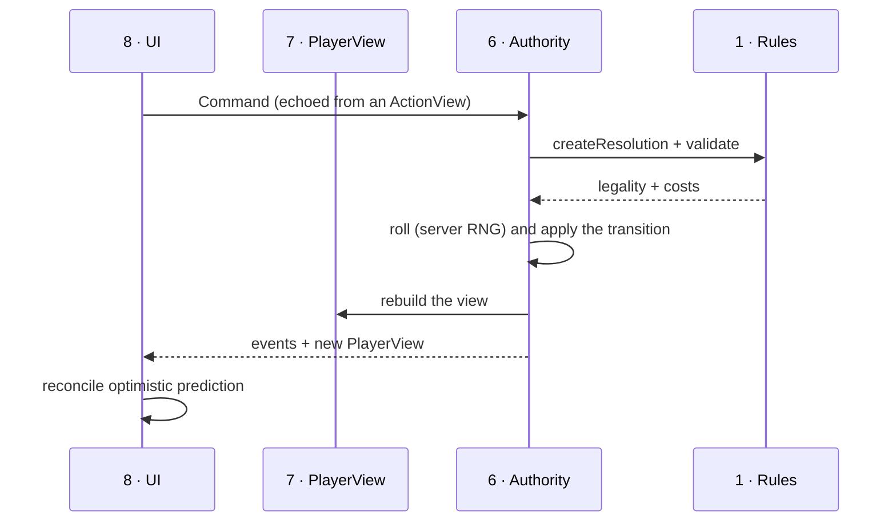

# The Player Contract

**Phase:** the read model and command boundary the eventual theatre UI consumes.
No visual UI, no artwork, no animation, no theatre changes.
**Implements:** `architecture.md` layers 6–8 (Server Authority, Events,
Presentation) — specifically the *contract* between them.

---

## 0. Three corrections to the obvious design

Three things fall out of what is already built, and all three change the shape.

**0.1 The view model must be a plain serialisable snapshot, not a live object.**
`Resolution` has methods, closures and memo tables. It crosses no network. The
player view is JSON that survives `structuredClone`, a Supabase broadcast and a
page reload. Everything in it is a value.

**0.2 Progressive disclosure is a payload concern before it is a UI concern.**
A full breakdown for every stat, skill, save and action is *large* — Sir Aldren's
AC alone carries seven terms including the ones that did not apply. Shipping
that for every value on every broadcast would make the HUD expensive to update
during a live session. So disclosure is a **tier on the builder**, not just a
disclosure triangle in the interface:

| Tier | Contains | Used by |
|---|---|---|
| `summary` | Totals and labels only | The HUD, broadcast at speech rate |
| `inspect` | Totals plus the applied contributors, in plain language | An opened tooltip or menu panel |
| `full` | Every term including the ones that did **not** apply, with reasons | The "Advanced" disclosure |

The same builder, one parameter. The UI never assembles a breakdown itself.

**0.3 "Spells" and "Abilities" should not be separate menu categories.**
The engine already unified them: a spell, a class feature, an item power and a
weapon attack are all `EffectSource` → `Action`. Splitting them into separate
tabs in the menu would re-fragment in the interface exactly what the
architecture spent this whole project unifying — and it would force the UI to
know which is which, which is the thing we are trying to prevent. They are one
list with facets. See §4.

---

## 1. The player view model

```
PlayerView {
  meta        { characterId, name, level, classes[], species, detail, contentHash }
  vitals      hitPoints, temporaryHitPoints, armorClass, speed, initiative
  abilities   six entries: score, modifier, save
  skills      eighteen entries: ability, proficiency state, total, passive
  resources   data-driven — the UI renders whatever is here
  equipment   slots, what fills them, what each contributes
  inventory   items grouped by function, not by rules category
  actions     everything the character can attempt, with availability
  effects     conditions and temporary effects, with sources and durations
  progression level, proficiency bonus, pending choices
  notices     things the engine could not decide (toggles, DM prompts)
}
```

Every numeric field is a `Readout`:

```
Readout {
  value: number
  label: string            // "Armor Class"
  display?: string         // "20", "+5", "25 ft" — presentation-ready
  breakdown?: Breakdown    // present at 'inspect' and 'full' only
}

Breakdown {
  total: number
  lines: { source, amount?, note?, applied, reason? }[]
  assumptions: string[]    // engine notes: "speed halving rounds down"
}
```

`display` exists so the UI never formats a game concept. `+5` versus `5` versus
`25 ft` is a rules-flavoured decision (a modifier is signed, a score is not),
and the engine already knows which it is.

### 1.1 Resources are data, never class knowledge

The UI must never contain `if (class === 'sorcerer')`. A resource is:

```
ResourceView {
  id, label
  current, maximum, spent
  display: 'uses' | 'pips' | 'pool' | 'dice' | 'slots'
  refresh: { kind, label }        // "on a short rest"
  sourceLabel                     // "Fighter" / "Sorcerer"
  group?: string                  // "Spell Slots" — for visual grouping only
  order?: number
  breakdown?: Breakdown           // how the maximum was derived
}
```

`display` is a **rendering hint carried by the content**, not a rule. Second
Wind is `uses` (1 of 1). Sorcery points are `pips` (5 discrete dots). Lay on
Hands is `pool` (a 25-point bar). Spell slots are `slots`, grouped by level.
A DM who invents a resource picks a hint; if they pick none, the UI falls back
to `uses`. Nothing in the engine or the interface branches on class.

### 1.2 Actions are one list with facets

```
ActionView {
  id, label, description?
  kind: 'attack' | 'cast' | 'ability' | 'item' | 'movement' | 'basic'
  cost: { type: 'action'|'bonusAction'|'reaction'|'free'|'movement'|'time', label }
  costs: { resourceId, amount, label }[]
  targeting: { selector, count?, rangeLabel? }
  available: boolean
  unavailableReasons: string[]     // REQUIRED when available is false
  preview?: { attackBonus?, damageLabel?, saveDc?, healLabel? }
  options?: { id, label, description? }[]   // GWM's -5/+10, upcast level
  command: Command                 // exactly what to send the server
  breakdown?: Breakdown
}
```

Two things matter here.

**`unavailableReasons` is a required array when unavailable.** The whole point of
the effect architecture is that the engine can say *why*. "Not enough sorcery
points", "you are incapacitated", "no free hand for somatic components". A
greyed-out button with no explanation is the Roll20 failure mode.

**`command` is the literal payload to send.** The UI does not construct commands
from action shapes; it echoes what it was given. That is what stops the client
from being able to invent an illegal action.

---

## 2. Contextual actions — where they come from

Actions are derived, never authored twice:

```mermaid
graph LR
  EQ[Equipped weapons] --> A1["kind: attack"]
  SRC["EffectSource.actions[]"] --> A2["kind: ability"]
  SPELL[Known/prepared spells] --> A3["kind: cast"]
  INV[Consumable items] --> A4["kind: item"]
  BASIC[Baseline actions] --> A5["kind: basic"]
  A1 & A2 & A3 & A4 & A5 --> AV{Availability}
  CAP[Capabilities] --> AV
  RES[Resources] --> AV
  REQ[Requirement predicates] --> AV
  AV --> OUT[ActionView with reasons]
end
```

Availability is the conjunction of three things the engine already computes:

1. **Capability** — `takeActions` is revoked while incapacitated, so *every*
   action of cost `action` becomes unavailable at once, with one reason, and no
   action needs to know what "stunned" means.
2. **Resources** — the action's costs against current remaining.
3. **Requirements** — the ordinary `Predicate`, evaluated by the ordinary
   evaluator, producing the ordinary human-readable failure reason.

Nothing new is invented. The reasons come out of `evaluate()`, which has been
producing them since the foundation.

---

## 3. Inventory and equipment

The player-facing grouping is **by what you do with a thing**, not by the rules
category:

| Group | Contains |
|---|---|
| `equipped` | Whatever currently fills a slot |
| `carried` | Everything else usable |
| `consumables` | Potions, scrolls, anything single-use |
| `valuables` | Coin, gems, art |
| `quest` | Story items, never equippable |

`ItemView` carries `slot`, `canEquip`, `equipReasons`, `attuned`,
`requiresAttunement`, and — importantly — `effectSummary`: the plain-language
list of what equipping it would do, derived from its modifiers rather than
authored as marketing text.

**The architectural rule holds unchanged:** an item declares effects; the
resolver decides whether they apply. A DM helmet with `+1 AC` and an SRD cloak
with `+1 AC` produce identical `ItemView`s apart from `provenance`.

---

## 4. Menu information architecture

**Four primary categories.** Fewer than the plan proposed, because the engine's
own unification makes several of them the same thing.

| Primary | Secondary | Why it exists |
|---|---|---|
| **Character** | Overview · Abilities & Skills · Proficiencies · Progression | Who you are and what you are good at |
| **Inventory** | Equipment · Carried · Consumables · Valuables | What you have |
| **Actions** | *facets:* All · Attacks · Spells · Abilities · Items | What you can do |
| **Effects** | Conditions · Buffs & Temporary · Passive traits | What is happening to you |

**Why Actions is one category with facets rather than separate Spells and
Abilities tabs:**

- A new player asking "what can I do?" gets **one** answer, not four tabs to
  hunt through. That is the single biggest simplification available.
- The engine produces one list; splitting it in the UI means the UI classifies
  game content, which is the coupling we are avoiding.
- Facets are a filter over `kind`, which is data. Adding a new kind of action
  later needs no menu change.
- A veteran who wants a spellbook selects the Spells facet and gets one.

**Resources deliberately have no menu category.** They appear in the HUD and
inline on the actions that consume them, because a resource in isolation is
meaningless — what a player wants to know is "can I cast this?", not "how many
sorcery points do I have?" in the abstract.

---

## 5. Progressive disclosure

Three levels, matching the three payload tiers in §0.2.

**Level 0 — HUD.** Hit points, AC, the equipped weapon, up to five pinned
actions, active conditions as icons, resources with a `display` hint. No
numbers a new player has to interpret. Roughly 2 KB of JSON.

**Level 1 — inspect.** Tapping anything opens a card: what it is, what it does
in one sentence, its cost and range, and the contributors that *applied*, in
plain language — *"16 Chain Mail · +2 Shield · +1 Defense · +1 Cloak of
Protection"*.

**Level 2 — advanced.** A disclosure inside the card, off by default and
remembered per player. Shows the complete term list including everything that
did **not** apply and why: *"10 unarmoured — lower base than Chain Mail (16)"*,
*"Dexterity — suppressed by Chain Mail"*. This is exactly `StatValue.terms`,
which the engine has always produced; the contract just labels it.

The new player never meets level 2. The veteran never has to leave the game to
reach it. Neither ever sees a character sheet as the primary surface.

---

## 6. The server boundary



**Commands** (the client may only echo what a view gave it):
`equipItem`, `unequipItem`, `attuneItem`, `endAttunement`, `useItem`,
`makeAttack`, `makeCheck`, `makeSave`, `useAbility`, `castSpell`,
`spendResource`, `restoreResource`, `applyCondition`, `removeCondition`,
`setToggle`, `shortRest`, `longRest`, `proposeTrade`, `respondToTrade`,
`dmOverride`.

**The reducer is pure.** `applyCommand(state, command, rolls) → { state, events,
rejected? }`. Randomness arrives as an argument, so the transition is
deterministic and testable; the authority is the only thing that calls the RNG.
This keeps the same property that made the resolver shareable between client and
server.

**Rejection is a first-class result**, not an exception: a rejected command
carries the same human reasons the `ActionView` would have shown, so a race
(two players grabbing the same item) produces an explanation rather than a
silent no-op.

---

## 7. Deliberately deferred

- **Spell effects.** Spells appear as *actions with costs* — enough for the HUD
  and the menu — but casting one does not yet apply its effect. That is the next
  milestone, and it needs the spell dataset.
- **Combat.** Turn order, action economy enforcement, opportunity attacks. The
  contract carries `cost.type` so the UI can group by it, but nothing enforces
  one action per turn yet.
- **The trade flow.** `proposeTrade` and `respondToTrade` are defined; the
  two-party state machine is not built.
- **Persistence and broadcast.** The reducer produces new state and events;
  wiring them to Postgres and Supabase realtime is layer 6 plumbing.
- **Visual anything.** No components, no artwork, no theatre changes.
